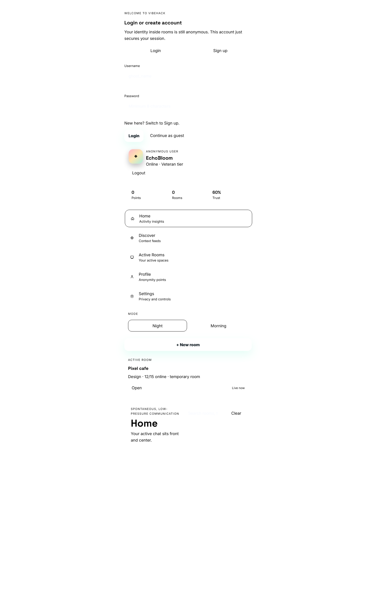
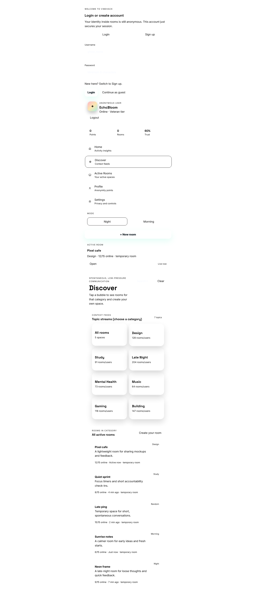
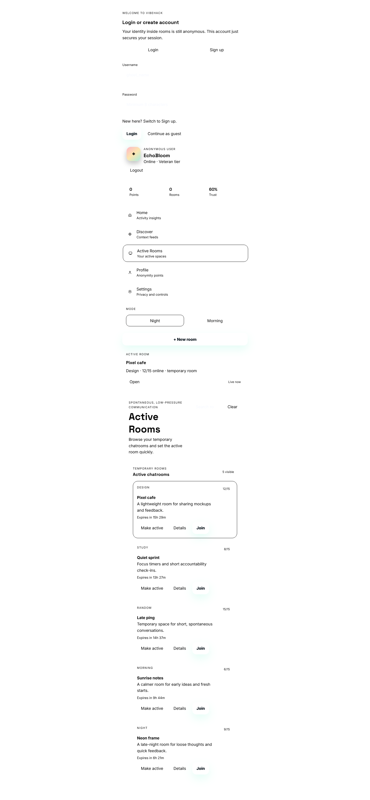
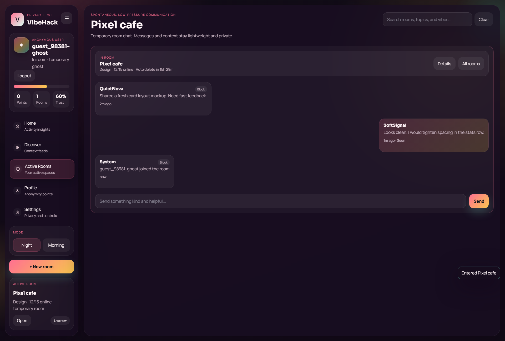
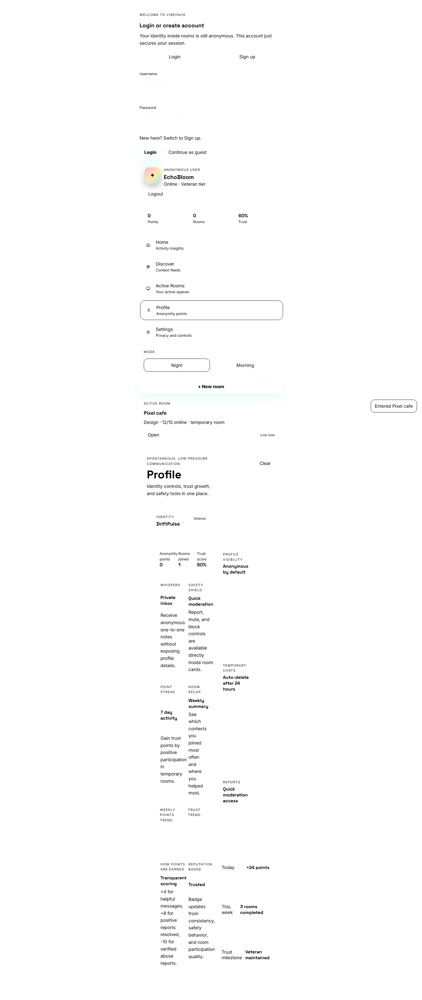
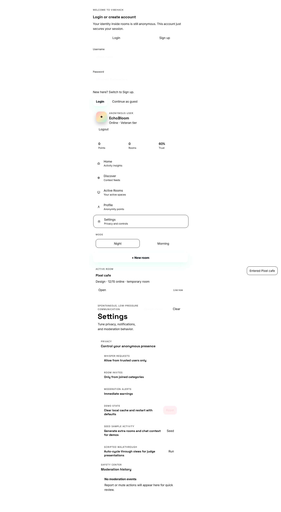

# VibeHack

VibeHack is a privacy-first anonymous social UI prototype built for hackathon judging.

## Core Experience

- Login / Sign up gate with guest mode for quick demos
- Anonymous identity with randomized avatar + handle
- Temporary room model with context-based discovery
- Sidebar-driven navigation (Home, Discover, Active Rooms, Profile, Settings)
- Day/Night themes, trust-style profile metrics, and lightweight analytics
- Local persistence for rooms, preferences, selected room, and settings

## Activity Point Criteria (Current)

Authenticity points are backend-owned (`User.auth_points`) and currently increase by:

1. Heartbeat activity: `+1` point when the client sends a `heartbeat` socket event while in a joined room.
2. Gifting points: `+1` point when another authenticated user calls `POST /api/users/gift/{ghost_name}`.

Current notes:

- No hard daily cap is enforced yet.
- Points are permanently stored in the database.
- Ghost identity pointer used for room privacy expires after 24 hours.

## Ghost Identity System (Complete Privacy)

When you join a room, your real identity is completely hidden. You receive a temporary ghost identity:

- **On Join**: Server generates a random ghost name like `SilentPanda_234`, `NeonSpectre_567`, etc.
- **While In Room**: Only your ghost name is visible to other users. Your real username is never exposed.
- **On Leave**: Ghost identity is immediately deleted from Redis. Your temporary persona vanishes.
- **Fallback (Offline)**: If backend unavailable, frontend generates equally random ghost names locally.

This ensures complete anonymity within rooms while maintaining user identity tracking for points and trust metrics outside chat.

## Feature Showcase

### Home Dashboard

### Room Discovery

### Active Rooms

### Temporary Ghost Room
When you join a room, your profile displays your temporary ghost identity. Other users only see this ghost name in the chat and room members list.

### User Profile

### Settings & Preferences

## Project Layout

- `frontend/` - complete user-facing application (HTML/CSS/JS)
- `backend/` - reserved for backend teammate integration
- `docs/` - AI prompt log and internal handoff notes

## Run Locally

Option 1:
- Open `frontend/index.html` directly in your browser.

Option 2 (static server):
- From repo root, run a local static server that points to `frontend/`.

## Frontend Testing

From `frontend/`:

1. `npm install`
2. `npm test`

Current suite covers auth utility validation and session flows.

## Judge Test (60 Seconds)

1. Login, sign up, or continue as guest.
2. Open app and switch between Home, Discover, Active Rooms, Profile, Settings.
3. Create a new room from Discover or Active Rooms.
4. Open room Details drawer and set a room active.
5. Toggle 1 to 2 settings and switch theme.
6. Refresh page and confirm state persisted.
7. Optional: use Settings -> Reset to restore clean demo defaults.

## Deployment

No repo workflow is required. Fastest zero-config option:

1. Import this repo into Vercel.
2. Keep project root at repo root (do not use `frontend` root override).
3. Deploy (repo includes `vercel.json` to force static frontend output and avoid Next.js auto-detection).

### Frontend + Backend Sync on Vercel

This repo now includes `vercel.json` rewrites so the frontend and backend stay connected automatically:

- `/api/*` -> proxied to backend deployment
- `/socket.io/*` -> proxied to backend deployment
- all other routes -> SPA fallback to `frontend/index.html`

Current backend target is configured in `vercel.json`. If your backend domain changes, update only these two rewrite destinations once and redeploy.

You can also use Netlify with the same setup:

1. New site from Git.
2. Base directory: `frontend`.
3. Publish directory: `.`

## Repo Hygiene

The following local reference files are intentionally ignored:

- `Command & Frontend.md`
- `Rules & Regulation.md`
- `docs/judge-handoff.md`
